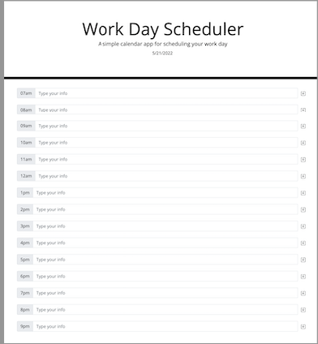

### Hi there 👋,

<h2 align="center">
I am a Software 💻 and Mechanical Engineer 🚀
</h2> 

### My name is Mario Acosta, and I am a Mexican living in Miami. I graduated as a Mechanical Engineer with a minor inc CS. I am passionate of using my engineer skills to solve the wolrd problems.

  

### 🔭 Repositories and some of my Projects:

 Click on the Github icon!  

#### Work Day Scheduler

 Work day scheduler [Github](https://github.com/macosta2015/FullStackHW6). 

 Work day scheduler [webpage](https://macosta2015.github.io/FullStackHW6/). 

<!-- Another way to add an image: -->
<!--  -->

  

#### Crypto-Check

 Crypto-Check [Github](https://github.com/AngelMond/Crypto-Check). 

 Crypto-Check [webpage](https://angelmond.github.io/Crypto-Check/). 

  

### Resume: 
<a align="center" href="https://drive.google.com/file/d/15hepHCvVzUCOb4y8ia93A7rGk-QsjfnF/view"> 💻​💼 Click for my resume! </a>

### 🤝 Connect with me:

 
<!--  -->

 
 .  

 
  ### Reach out: 
 
-  email: macosta2015@my.fit.edu
-  phone number: 2103022291
